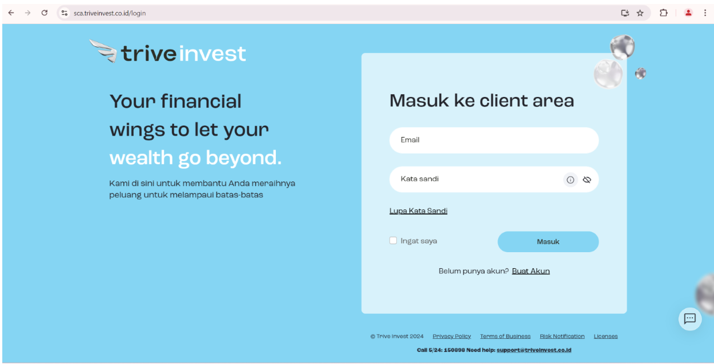
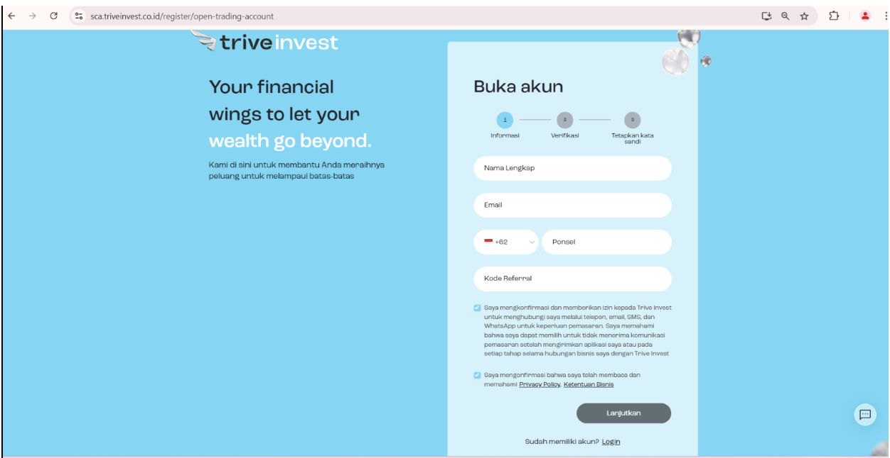
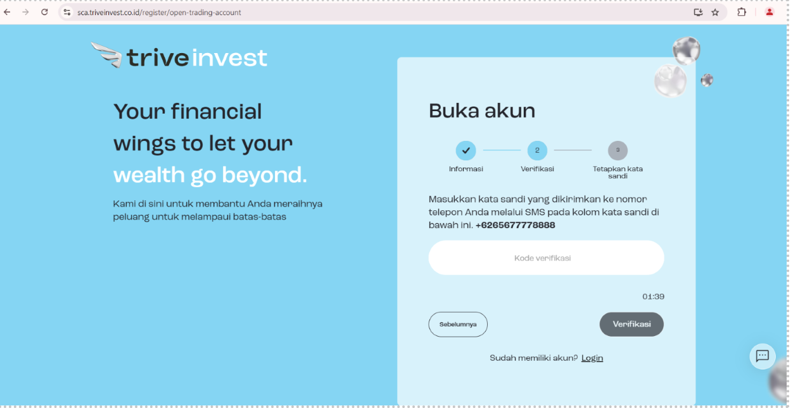
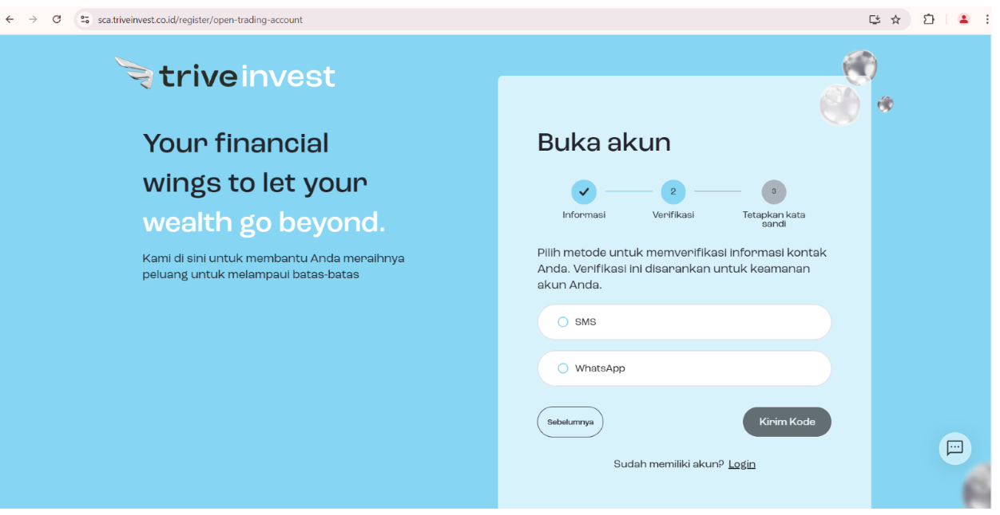
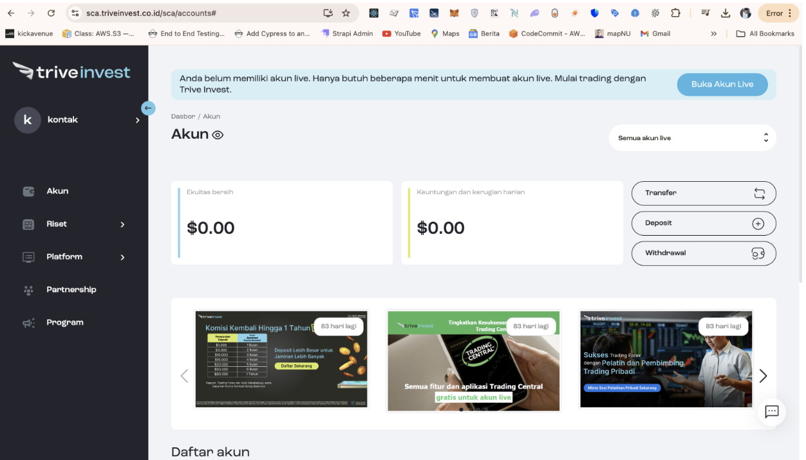
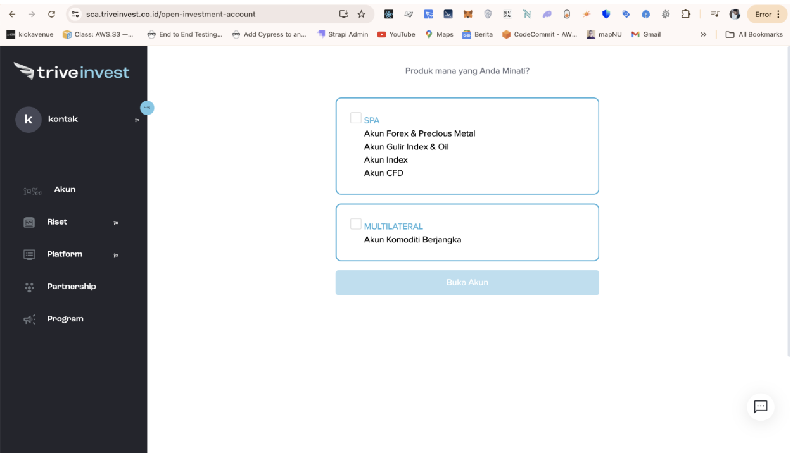
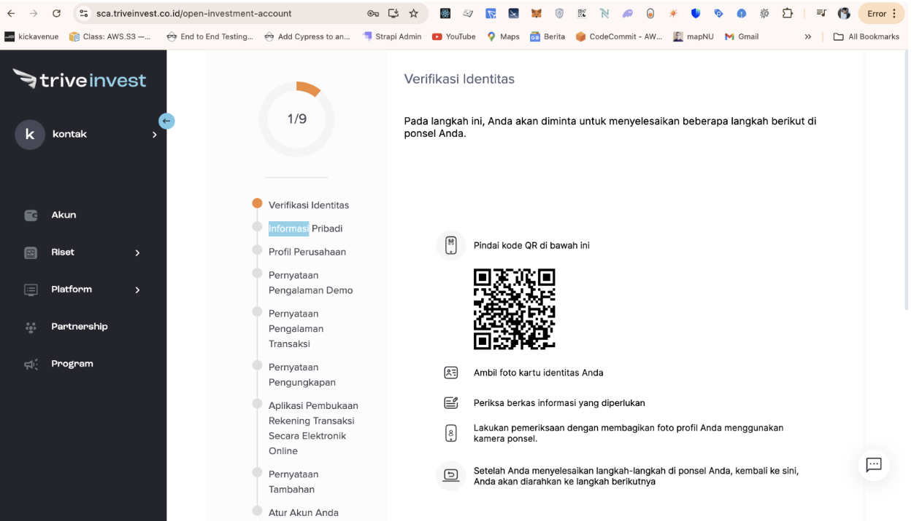
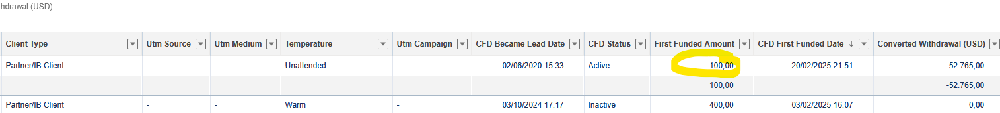

# Implementation of Data Layer Push for Button Click Events

## Objective
Adding details to the data layer in Google Tag Manager (GTM) serves the purpose of streamlining data collection from your website or application. The data layer is a JavaScript object that stores specific information, such as user interactions, viewed products, or completed transactions, in an accessible format for GTM.

Here are the benefits: 

  - **Simplifies tracking**:  
    Captures important information like button clicks, scrolling, or purchases without additional code on various elements.  

  - **Facilitates analytics integration**:  
    Sends data to tools like Google Analytics, Facebook Pixel, and more for deeper insights.  

  - **Improves tag management efficiency**:  
    Reduces the number of manually configured tags by leveraging the data in the data layer.  

  - **Supports personalized campaigns**:  
    Helps create targeted marketing strategies using collected data without shared PII.  

This approach is especially helpful for complex websites, keeping data organized and manageable. 

## Overview
This document outlines the process of implementing data layer push functionality for button click events on the SCA Trive Invest website. This implementation enhances tracking and analysis of user interactions using Google Tag Manager (GTM) and Google Analytics 4 (GA4).


## Page to Implement
## 1. **Login Page**: [https://sca.triveinvest.co.id/login](https://sca.triveinvest.co.id/login)

   

**Implementation Steps**

**a. Verify Google Tag Manager Container ID**
- Check the existing Google Tag Manager code on the page.
- Confirm that the container ID is `GTM-PD3TMG57`. If it differs, update it to match.

**b. Insert GTM Code**
- Add the following Google Tag Manager script to the `<head>` section of the login page:

```html
<!-- Google Tag Manager -->
<script>
(function(w,d,s,l,i){
  w[l]=w[l]||[];
  w[l].push({'gtm.start': new Date().getTime(), event:'gtm.js'});
  var f=d.getElementsByTagName(s)[0],
      j=d.createElement(s),
      dl=l!='dataLayer'?'&l='+l:'';
  j.async=true;
  j.src='https://www.googletagmanager.com/gtm.js?id='+i+dl;
  f.parentNode.insertBefore(j,f);
})(window,document,'script','dataLayer','GTM-PD3TMG57');
</script>
<!-- End Google Tag Manager -->
```

- Additionally, insert the following code at the beginning of the <body> tag if the container ID is not GTM-PD3TMG57

```html
<!-- Google Tag Manager (noscript) --> 
<noscript><iframe src="https://www.googletagmanager.com/ns.html?id=GTM-PD3TMG57" 
 height="0" width="0" style="display:none;visibility:hidden"></iframe></noscript> 
<!-- End Google Tag Manager (noscript) -->
```

- Implement data push layer on button: 
For React or other JavaScript frameworks, you can create a reusable component or hook. 

 
```html
function pushToDataLayer(buttonName){  

  window.dataLayer = window.dataLayer || [];  

  window.dataLayer.push({  

    'event': 'buttonClick',  

    'buttonName': buttonName,  

     ‘userId’: userId, ---> get this user id from db,  

     'status' : status --> get this status user from db, 

    'pagePath': window.location.pathname  

  });  

} 

<button type="submit" onclick="pushToDatalayer('Masuk')" class="btn btn-blue w-100">Masuk</button> 
```

## 2. **Register Page**: [https://sca.triveinvest.co.id/register/open-trading-account](https://sca.triveinvest.co.id/register/open-trading-account)

   
   
   

**a. Verify Google Tag Manager Container ID**
- Check the existing Google Tag Manager code on the page.
- Confirm that the container ID is `GTM-PD3TMG57`. If it differs, update it to match.

**b. Insert GTM Code**
- Add the following Google Tag Manager script to the `<head>` section of the login page:

```html
<!-- Google Tag Manager -->
<script>
(function(w,d,s,l,i){
  w[l]=w[l]||[];
  w[l].push({'gtm.start': new Date().getTime(), event:'gtm.js'});
  var f=d.getElementsByTagName(s)[0],
      j=d.createElement(s),
      dl=l!='dataLayer'?'&l='+l:'';
  j.async=true;
  j.src='https://www.googletagmanager.com/gtm.js?id='+i+dl;
  f.parentNode.insertBefore(j,f);
})(window,document,'script','dataLayer','GTM-PD3TMG57');
</script>
<!-- End Google Tag Manager -->
```

- Additionally, insert the following code at the beginning of the <body> tag if the container ID is not GTM-PD3TMG57

```html
<!-- Google Tag Manager (noscript) --> 
<noscript><iframe src="https://www.googletagmanager.com/ns.html?id=GTM-PD3TMG57" 
 height="0" width="0" style="display:none;visibility:hidden"></iframe></noscript> 
<!-- End Google Tag Manager (noscript) -->
```

- Implement data push layer on button: 
For React or other JavaScript frameworks, you can create a reusable component or hook. 

```html
function pushToDataLayer(buttonName){  

  window.dataLayer = window.dataLayer || [];  

  window.dataLayer.push({  

    'event': 'buttonClick',  

    'buttonName': buttonName,  

    'userId ': userId, ---> get this user id from db, 

    'status': status, ---> get this status user from db, 

    'step': step, --> get this step (informasi,verifikasi,tampilkan kata sandi) from ui step register page, 

    'pagePath': window.location.pathname  

  });  

} 

 

<button type="submit" onclick="pushToDatalayer('Lanjutkan')" class="btn btn-black w-100" disabled=""> Lanjutkan</button> 

 

<button onclick="pushToDatalayer('Kirim kode')" class="btn btn-black text-capitalize v-button" disabled="">Kirim kode</button> 

 

<button onclick="pushToDatalayer('Verifikasi')" class="btn btn-black  text-capitalize" disabled="">Verifikasi</button>
```

## 3. **Account Page**: [https://sca.triveinvest.co.id/accounts](https://sca.triveinvest.co.id/accounts)

   

**a. Verify Google Tag Manager Container ID**
- Check the existing Google Tag Manager code on the page.
- Confirm that the container ID is `GTM-PD3TMG57`. If it differs, update it to match.

**b. Insert GTM Code**
- Add the following Google Tag Manager script to the `<head>` section of the login page:

```html
<!-- Google Tag Manager -->
<script>
(function(w,d,s,l,i){
  w[l]=w[l]||[];
  w[l].push({'gtm.start': new Date().getTime(), event:'gtm.js'});
  var f=d.getElementsByTagName(s)[0],
      j=d.createElement(s),
      dl=l!='dataLayer'?'&l='+l:'';
  j.async=true;
  j.src='https://www.googletagmanager.com/gtm.js?id='+i+dl;
  f.parentNode.insertBefore(j,f);
})(window,document,'script','dataLayer','GTM-PD3TMG57');
</script>
<!-- End Google Tag Manager -->
```

- Additionally, insert the following code at the beginning of the <body> tag if the container ID is not GTM-PD3TMG57

```html
<!-- Google Tag Manager (noscript) --> 
<noscript><iframe src="https://www.googletagmanager.com/ns.html?id=GTM-PD3TMG57" 
 height="0" width="0" style="display:none;visibility:hidden"></iframe></noscript> 
<!-- End Google Tag Manager (noscript) -->
```

- Implement data push layer on button: 
For React or other JavaScript frameworks, you can create a reusable component or hook. 

```html
function pushToDataLayer(buttonName){  

  window.dataLayer = window.dataLayer || [];  

  window.dataLayer.push({  

    'event': 'buttonClick',  

    'buttonName': buttonName,  

    'userId ': userId, ---> get this user id from db, 

    'status': status, ---> get this status user from db, 

    'pagePath': window.location.pathname  

  });  

} 

 

<a onclick="pushToDatalayer('Buka Akun Live')" class="btn btn-blue text-white ms-lg-5 mt-3 mt-lg-0" rel="noreferrer" href="/open-investment-account">Buka Akun Live</a> 
```


## 4. **Open Investment Account Page**: [https://sca.triveinvest.co.id/open-investment-account](https://sca.triveinvest.co.id/open-investment-account)

   
   

**a. Verify Google Tag Manager Container ID**
- Check the existing Google Tag Manager code on the page.
- Confirm that the container ID is `GTM-PD3TMG57`. If it differs, update it to match.

**b. Insert GTM Code**
- Add the following Google Tag Manager script to the `<head>` section of the login page:

```html
<!-- Google Tag Manager -->
<script>
(function(w,d,s,l,i){
  w[l]=w[l]||[];
  w[l].push({'gtm.start': new Date().getTime(), event:'gtm.js'});
  var f=d.getElementsByTagName(s)[0],
      j=d.createElement(s),
      dl=l!='dataLayer'?'&l='+l:'';
  j.async=true;
  j.src='https://www.googletagmanager.com/gtm.js?id='+i+dl;
  f.parentNode.insertBefore(j,f);
})(window,document,'script','dataLayer','GTM-PD3TMG57');
</script>
<!-- End Google Tag Manager -->
```

- Additionally, insert the following code at the beginning of the <body> tag if the container ID is not GTM-PD3TMG57

```html
<!-- Google Tag Manager (noscript) --> 
<noscript><iframe src="https://www.googletagmanager.com/ns.html?id=GTM-PD3TMG57" 
 height="0" width="0" style="display:none;visibility:hidden"></iframe></noscript> 
<!-- End Google Tag Manager (noscript) -->
```

- Implement data push layer on button: 
For React or other JavaScript frameworks, you can create a reusable component or hook. 

```html
function pushToDataLayer(buttonName){  

  window.dataLayer = window.dataLayer || [];  

  window.dataLayer.push({  

    'event': 'buttonClick',  

    'buttonName': buttonName,  

    'userId ': userId, ---> get this user id from db, 

    'status': status, ---> get this status user from db, (lead, demo,application, account) 

   ‘account_selection’ : account_selection --> spa/multi 

   ‘user_phase’: user phase (verify) 

   'pagePath': window.location.pathname  

  });  

} 

 
<a onclick="pushToDatalayer('Buka Akun')" id="nextState" class="btn as-btn-primary disabled-button" tabindex="0">Buka Akun</a> 
```


## 5. **First Deposit (First Funded Amount) Tracking After Successful Registration**: [https://sca.triveinvest.co.id/accounts](https://sca.triveinvest.co.id/accounts)




**a. Verify Google Tag Manager Container ID**
- Check the existing Google Tag Manager code on the page.
- Confirm that the container ID is `GTM-PD3TMG57`. If it differs, update it to match.

**b. Insert GTM Code**
- Add the following Google Tag Manager script to the `<head>` section of the login page:

```html
<!-- Google Tag Manager -->
<script>
(function(w,d,s,l,i){
  w[l]=w[l]||[];
  w[l].push({'gtm.start': new Date().getTime(), event:'gtm.js'});
  var f=d.getElementsByTagName(s)[0],
      j=d.createElement(s),
      dl=l!='dataLayer'?'&l='+l:'';
  j.async=true;
  j.src='https://www.googletagmanager.com/gtm.js?id='+i+dl;
  f.parentNode.insertBefore(j,f);
})(window,document,'script','dataLayer','GTM-PD3TMG57');
</script>
<!-- End Google Tag Manager -->
```

- Additionally, insert the following code at the beginning of the <body> tag if the container ID is not GTM-PD3TMG57

```html
<!-- Google Tag Manager (noscript) --> 
<noscript><iframe src="https://www.googletagmanager.com/ns.html?id=GTM-PD3TMG57" 
 height="0" width="0" style="display:none;visibility:hidden"></iframe></noscript> 
<!-- End Google Tag Manager (noscript) -->
```

- Implement data push layer on button: 
For React or other JavaScript frameworks, you can create a reusable component or hook. 

```html
function pushFirstDepositAfterRegistration(userId, amount, currency, status, registrationTime) {  
  window.dataLayer = window.dataLayer || [];  

  window.dataLayer.push({  
    'event': 'firstDepositAfterRegistration',  
    'userId': userId,  
    'amount': amount,  
    'currency': currency,  
    'status': status,  
    'registrationTime': registrationTime,  
    'pagePath': window.location.pathname  
  });  
}  

<button onclick="pushFirstDepositAfterRegistration('123456', 100, 'USD', 'live', '2025-03-20T12:00:00Z')">Deposit</button>
```


